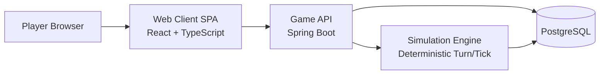
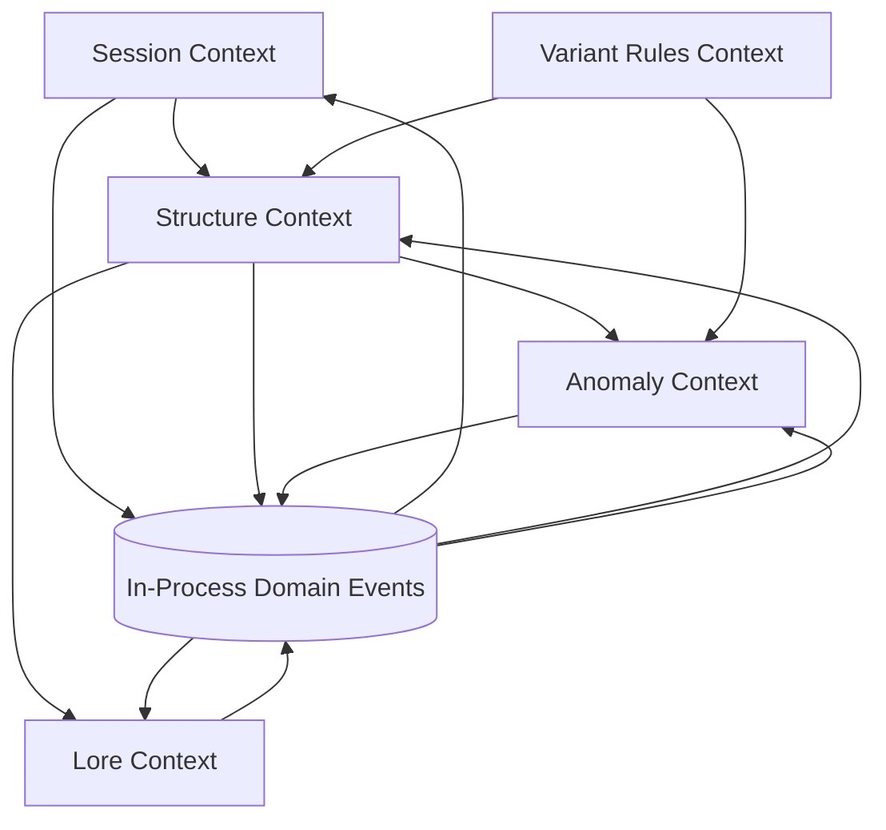
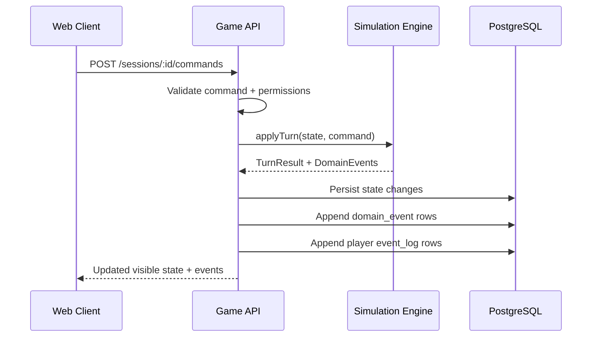
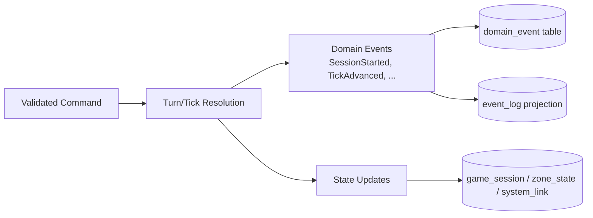

# The Last Megastructure: Architecture

## Purpose
This document defines the baseline architecture for a browser-based version of *The Last Megastructure* hosted locally in Docker containers.

It is designed to:
- preserve the story tone from `README.md` (mystery, partial control, incomplete knowledge)
- support iterative development
- allow the three variants to share a core runtime while keeping distinct mechanics

## Architectural Principles
- **Custodian perspective first**: UI and systems should expose partial insight, never full certainty.
- **Systemic storytelling**: narrative emerges from system state, logs, anomalies, and fragments.
- **Shared core, variant overlays**: one simulation core, variant-specific rules layered on top.
- **Deterministic simulation**: game state advances by explicit ticks/events to simplify debugging and replays.
- **Local-first development**: everything required to run v1 should start via `docker compose`.
- **DDD-oriented modelling**: model gameplay with explicit bounded contexts, ubiquitous language, and aggregates.
- **KISS for v1**: keep a modular monolith; use domain events internally before adopting distributed event-driven architecture.

## v1 Scope
- Single-player browser game.
- Session-based progression saved to a local database.
- Core loop:
  1. inspect available zones/signals
  2. route energy / trigger actions
  3. process simulation tick
  4. observe state changes, anomalies, and new fragments
- One playable vertical slice per variant, sharing the same technical platform.

## High-Level System
1. **Web Client (SPA)**
Renders the map, zones, subsystem panels, and narrative fragments.

2. **Game API**
Owns session lifecycle, command validation, simulation orchestration, and persistence.

3. **Simulation Engine (module in API for v1)**
Executes deterministic turns/ticks and applies variant rules.

4. **Database (PostgreSQL)**
Stores sessions, zone state, event log, discovered fragments, and checkpoints.

5. **Optional Cache/Event Bus (deferred)**
Not required for v1. Add Redis only if needed for performance or async jobs.



## Domain-Driven Design (DDD) View
Use a modular monolith with bounded contexts that can later be extracted if needed.

Initial bounded contexts:
- **Session Context**: game session lifecycle, tick progression, save/checkpoint ownership.
- **Structure Context**: zones, links, energy routing, subsystem state transitions.
- **Anomaly Context**: instability, anomaly emergence, spatial/logic distortions.
- **Lore Context**: fragments, unlock conditions, narrative evidence and interpretation.
- **Variant Rules Context**: per-variant policy and rule composition (`drift-protocol`, `entropy-rising`, `broken-orbit`).

Context integration approach (v1):
- Direct in-process calls between modules when needed.
- Domain events for decoupling inside the monolith.
- No external broker required yet (KISS).



## Technology Stack (v1)
- **Frontend**: Node.js 24 LTS, React 19.2 + TypeScript 5.9 + Vite 7 + Tailwind CSS  4.1 + Shadcn UI 3.x + pnpm 10
- **Backend**: Java 21, Spring Framework 7.x (via Spring Boot), Spring Boot 4.0.x, Gradle Groovy DSL, Gradle Wrapper 9.x
- **Database**: PostgreSQL
- **ORM/DB layer**: Spring Data JPA + Hibernate
- **Database migrations**: Flyway (versioned SQL scripts)
- **Container orchestration (local)**: Docker Compose
- **Testing**:
  - frontend: Vitest + Playwright (smoke flows)
  - backend: JUnit + Spring Boot Test + integration tests against Postgres (Testcontainers)

## Runtime Model
- The game runs as a server-authoritative simulation.
- The client sends high-level commands (for example: activate zone, reroute energy, scan anomaly).
- API validates command against current state.
- Simulation engine computes the next state deterministically.
- API stores the resulting state and appends immutable entries (event log + domain event records).
- Client receives updated projection (state + events + newly visible information).

This model supports mystery by controlling what is revealed versus what is merely inferred.



## Narrative-to-System Mapping
- **Unknown origin**: lore fragments are unlocked via exploration and system triggers, not linear exposition.
- **Partial control**: many zones begin locked, unstable, or probabilistic.
- **Ambiguity**: telemetry is intentionally incomplete; scans return confidence levels, not absolutes.
- **Ancient active machine**: background processes can mutate the structure between player turns.

## Variant Architecture
Use a shared core with a `ruleset` interface:

```ts
interface Ruleset {
  id: "drift-protocol" | "entropy-rising" | "broken-orbit";
  applyTurn(state: GameState, command: PlayerCommand): TurnResult;
  backgroundStep(state: GameState): GameState;
  visibility(state: GameState): PlayerVisibleState;
}
```

- `drift-protocol`: emphasise hidden protocol states and network interactions.
- `entropy-rising`: add decay and instability budgets to all actions.
- `broken-orbit`: include anomaly-driven map topology shifts.

## Aggregates and Domain Events (Initial Suggestion)
Suggested aggregates:
- `GameSession` aggregate: owns tick advancement and command processing boundary.
- `ZoneNetwork` aggregate: owns zone/link invariants and routing validity.
- `AnomalyField` aggregate: owns anomaly lifecycle and instability thresholds.
- `LoreArchive` aggregate: owns unlock rules and discovered fragment consistency.

Example domain events (internal, in-process):
- `SessionStarted`
- `CommandAccepted`
- `TickAdvanced`
- `EnergyRerouted`
- `ZoneStabilised`
- `AnomalyDetected`
- `AnomalyEscalated`
- `FragmentRecovered`

For v1, publish these events in-process and persist them for audit/replay. Do not introduce asynchronous distributed messaging yet.



## Suggested Repository Shape
Adopt the following monorepo layout:

```text
/
  drift-protocol/         # variant-specific content/rules/UI adjustments
  entropy-rising/
  broken-orbit/
  shared/
    engine/               # deterministic simulation core
    lore/                 # shared fragments/canon dictionaries
    ui-components/        # reusable presentation components
  backend/
  frontend/
  docs/
    ARCHITECTURE.md
    adr/
```

## Data Model (Initial)
- `game_session`: id, variant, created_at, updated_at, current_tick
- `zone_state`: session_id, zone_id, status, energy, instability, metadata(jsonb)
- `system_link`: session_id, from_zone, to_zone, capacity, integrity
- `event_log`: session_id, tick, event_type, payload(jsonb)
- `domain_event`: id, session_id, tick, context, event_name, event_version, payload(jsonb), occurred_at
- `lore_fragment`: id, fragment_key, text, source_type
- `session_fragment_unlock`: session_id, fragment_id, unlocked_at

## API Surface (Initial)
- `POST /sessions` create new session for a variant
- `GET /sessions/:id/state` get player-visible state
- `POST /sessions/:id/commands` submit a command and advance simulation
- `GET /sessions/:id/events?fromTick=N` poll event stream
- `POST /sessions/:id/save` optional named checkpoint

For v1, HTTP polling is sufficient. WebSocket/SSE can be added later for richer live updates.

## Event-Driven Evolution Path (Future, Not v1)
- Current approach: domain events inside a modular monolith.
- Future option: move to event-driven architecture when scaling requires independent deployment or asynchronous workflows.
- Trigger to revisit: sustained performance bottlenecks, team scaling across contexts, or hard coupling between modules.
- Candidate future additions: outbox pattern, message broker, independent context services.

## Docker Local Deployment (v1)
`docker-compose.yml` services:
- `web`: frontend dev/prod container
- `api`: backend container
- `db`: postgres with persisted volume

Expected local flow:
1. `docker compose up --build`
2. API runs Flyway migrations and seed data on startup (or via explicit task container)
3. Web serves the client and connects to API on internal Docker network

## Observability and Debugging
- Structured logs with `session_id`, `tick`, `variant`, and `command`.
- Developer-only debug panel in UI to inspect recent events and derived state.
- Deterministic seed per session to reproduce anomaly patterns during testing.

## Security and Integrity (v1 baseline)
- Treat client input as untrusted; validate commands server-side.
- Use schema validation for all API payloads.
- Keep event log append-only to support audits/replays.

## Risks and Mitigations
- **Risk**: variant logic diverges too early.
Mitigation: enforce `ruleset` contract and shared simulation primitives.

- **Risk**: narrative tone lost in mechanical UI.
Mitigation: ship lore fragments/events in first vertical slice, not as late polish.

- **Risk**: over-engineering v1.
Mitigation: keep simulation inside API process first; split services only when justified by ADR.

- **Risk**: premature event-driven complexity.
Mitigation: keep domain events in-process and persisted; introduce distributed EDA only with clear scaling evidence.
