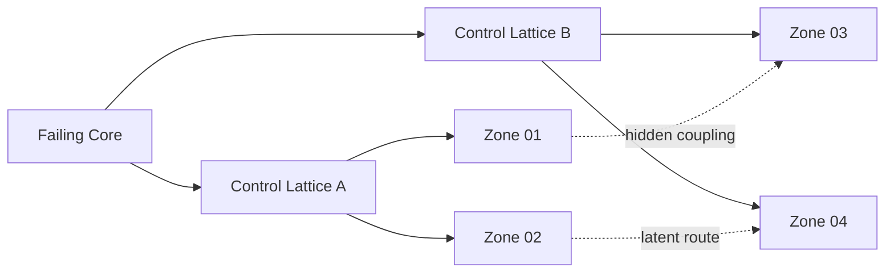
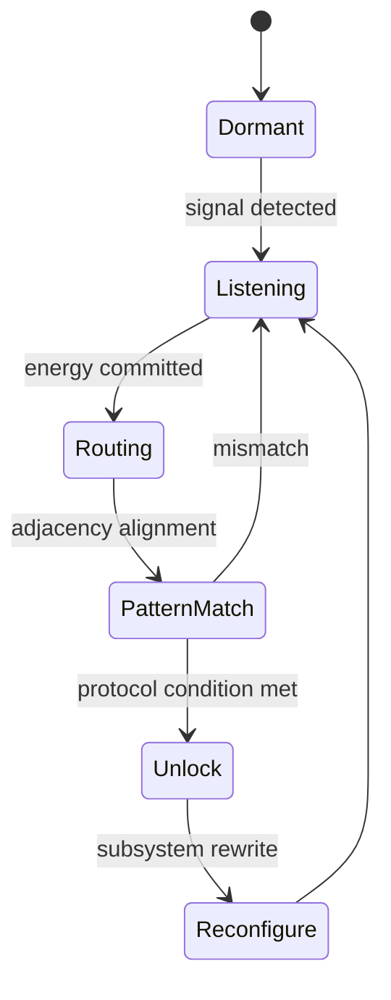
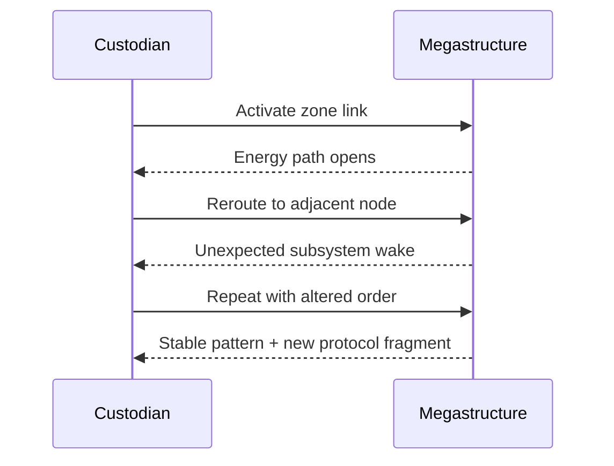

# The Last Megastructure: Drift Protocol

## Premise

The Megastructure is not broken.

It is operating under a protocol.

One that you do not fully control.

---

## Core Idea

Every system you activate is part of a larger, hidden logic:
- energy flows are not just resources—they are signals
- zone connections form patterns
- reconfiguration changes behaviour in non-obvious ways

You are not just repairing the structure.

You are **learning its rules**.

---

## Visual Language (Drift Protocol)

### Signal Topology (What You See)

### Hidden Protocol States (What It Is Doing)

### Command Response Loop (How You Learn)

---

## Gameplay Focus

- Energy routing as a **network puzzle**
- Zone interaction and adjacency effects
- Hidden system states and emergent behaviour
- Discovering “protocols” through experimentation

---

## Player Experience

- Curiosity-driven
- System mastery over time
- Subtle, layered complexity
- “I didn’t know it could do that”

---

## Narrative Tone

- Cold, technical, mysterious
- The structure feels **intentional**
- You are interfacing with something that may still be executing its original function

---

## Key Question

> Are you restoring the Megastructure… or activating something it was waiting to become?
