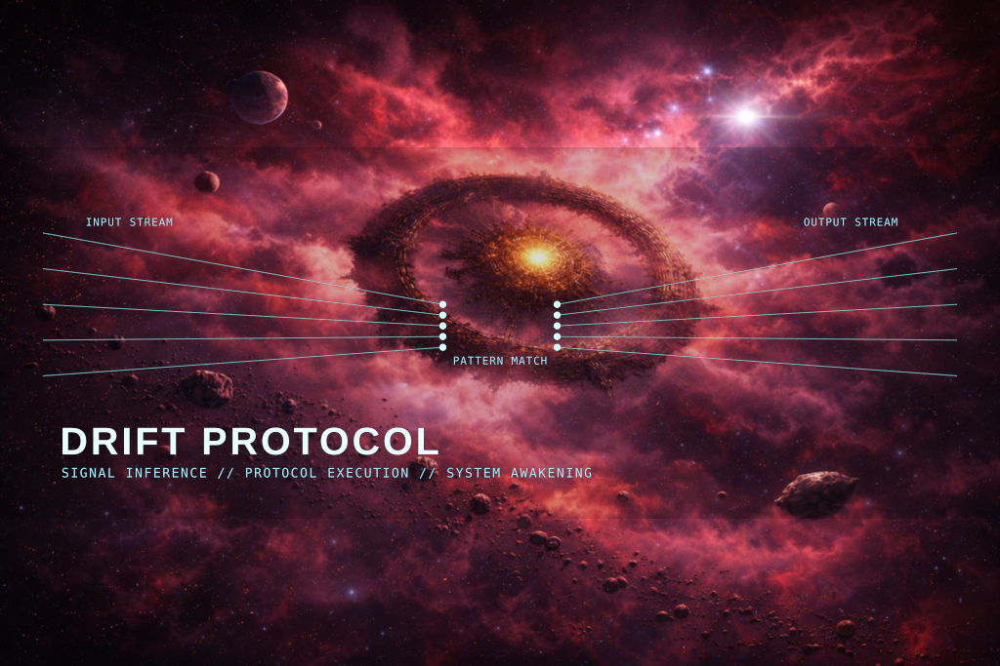

# The Last Megastructure: Drift Protocol

## Story Intent

*Drift Protocol* is the variant where the player learns by inference.

The Megastructure does not explain itself. It responds.
Every response is data.
Every pattern is a possible sentence in a language that may pre-date known civilisation.

The story should make the player feel they are interpreting an ancient system in real time, not following a scripted tour.

---

## Narrative Premise

After network collapse across peripheral colonies, a repeating non-linguistic signal appears beyond mapped space.
The signal behaves like a handshake and matches no known archive standard.

Multiple missions fail to maintain contact.
Your custodial vessel, **Rook-7**, is the first to establish sustained interface with an active section of the Megastructure.

You are not deployed as a conqueror or claimant.
You are deployed under a custodial mandate:
- preserve continuity of critical systems where possible
- prevent unstable cascade events
- recover operational understanding through controlled interaction
- avoid irreversible activation without interpretive confidence

The mission begins as technical recovery.
It becomes an argument over what "recovery" means when system intent is unknown.

---

## Core Story Thesis

The Megastructure is not failing at random.
It is executing a protocol chain with missing context.

What appears to be damage is often conditional lockout.
What appears to be repair is often participation.

The player’s central narrative action is this:
- observe behaviour
- test hypotheses
- accept that each successful pattern unlock may change the rules of future interpretation

---

## Setting: The Drift Sector

The playable region is a drifting shell segment called **Protocol Lattice 9**.
It contains:
- a decaying command spine
- mirrored zone clusters with asymmetrical behaviour
- sealed memory vaults that only open under specific signal geometry
- infrastructure that re-routes itself after each validated pattern

Nothing in this sector is stable for long.
Routes that were safe become silent.
Dormant nodes become vocal.
System maps are provisional documents.

---

## Cast Functions (Narrative Roles)

The game should use a compact cast whose role is interpretive tension, not exposition certainty.

### The Custodian (Player)

Role:
- systems operator
- field theorist by necessity
- witness to contradictory evidence

The player’s log is procedural, not heroic.
Their authority grows with accuracy, not rank.

### Relay Analyst Ione Vale (Remote)

Represents probabilistic caution.
Advocates delaying activation until pattern confidence is high.
Provides alternative readings that often conflict with immediate tactical needs.

### Systems Marshal Kade Rhun (Expedition Command)

Represents operational pressure.
Prioritises uptime, route security, and mission deliverables.
Pushes for decisive action when ambiguity threatens survival.

### The Structure Itself

The primary "character" is behavioural.
Its dialogue is:
- topology changes
- timed response windows
- selective subsystem wakes
- fragment release after pattern completion

The player should slowly suspect that the Megastructure is evaluating custodial behaviour, not merely accepting input.

---

## Story Progression

## Phase I: Contact and Containment

Goals:
- stabilise a minimal power triangle
- establish a repeatable routing corridor
- prove that response order matters

Narrative beats:
- first successful unlock reveals that inactive zones were waiting for sequence, not energy volume
- fragments reference prior custodians, but identities are redacted or overwritten
- command learns this is not generic salvage

Player feeling:
- technical curiosity with controlled dread

## Phase II: Pattern Literacy

Goals:
- build a protocol lexicon from repeated interactions
- identify false-positive patterns that appear valid but trigger drift events
- decide which subsystems to wake when resources cannot support all pathways

Narrative beats:
- mirrored clusters produce opposite outcomes from near-identical commands
- two credible interpretations of the same fragment lead to incompatible plans
- first major reconfiguration event permanently alters traversal logic

Player feeling:
- increasing mastery paired with shrinking certainty

## Phase III: Custodial Schism

Goals:
- choose between immediate stability and deep protocol completion
- resolve conflict between command urgency and interpretive caution
- commit to a theory of what the current chain is trying to do

Narrative beats:
- evidence emerges that prior mission failures may have been deliberate aborts
- the Megastructure begins opening zones before direct request, implying predictive modelling of player behaviour
- the player must either halt a chain or complete it without full semantic clarity

Player feeling:
- responsibility under incomplete truth

## Phase IV: Threshold State

Goals:
- execute final pattern alignment across the active lattice
- preserve as much continuity as possible under cascading instability
- accept that the outcome is interpreted, not explained

Narrative beats:
- unlocked archive confirms function classes but withholds origin
- "repair" pathways and "activation" pathways converge into the same final state graph
- final system response depends on prior behavioural profile, not one endgame choice

Player feeling:
- earned ambiguity

---

## End-State Framework

Drift Protocol should end in interpretable states, not absolute answers.

### Contained Continuity

The lattice remains stable under strict protocol discipline.
Access expands slowly.
Command classifies the sector as survivable but not understood.

### Accelerated Awakening

Large portions of the lattice reactivate quickly.
Capability increases, predictability declines.
The mission survives, but human control becomes conditional.

### Silent Recession

The player prevents catastrophic activation by breaking key chains.
The sector enters low-power silence.
Future custodians inherit a safer but less knowable structure.

Each ending should reinforce the same truth:
the player did not solve the Megastructure;
they negotiated with it.

---

## Gameplay-Story Integration Rules

- Mechanical success should always reveal information, not just reward output.
- Every major unlock should create at least one new uncertainty.
- Fragment text should be specific enough to form hypotheses, never complete enough to settle them.
- Contradictory evidence is a feature, not a bug.
- Player logs should track observed behaviour and confidence levels, not canonical truths.

---

## Narrative Tone Guide

- Clinical language under pressure.
- Ancient systems with present-tense agency.
- Mystery through behaviour, not jump-scare spectacle.
- Tension from interpretation cost: a wrong theory has systemic consequences.

The tone target is: *calm procedures at the edge of ontological risk*.

---

## Key Question

> If the protocol recognises your behaviour, are you restoring a machine, or passing an ancient test for custodianship?
